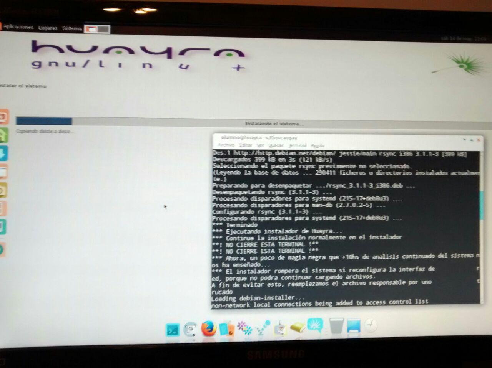

# Huayra Nerwork boot PXE Installer
Creamos este script para facilitar la instalación de Huayra Linux habiendo arrancado vía PXE (instalación vía red).  

## ¿Cómo se usa?
Iniciar Huayra en modo vivo (Live) vía PXE boot y luego basta con ejecutar el script, que hará el resto. Se mostrarán instrucciones en pantalla, ¡no las omita!.  

## ¿Qué hace el script?
Ejecuta el instalador `debian-installer-launcher` y soluciona los problemas del mismo.

### Problema 1
Ejecutar el instalador: al iniciar en vivo/live, el instalador no se encuentra con facilidad, salvo que realmente se lo busque.  

#### Solución
Ejecutar el instalador `debian-installer-launcher`.  

### Problema 2
Al inciar la instalación, luego de unos pasos, el instalador tratará de reconocer los dispositivos de red. Al hacerlo, reiniciará la conexión actual, pero al haberse iniciado por PXE, requiere de la red para funcionar. Como consecuencia, la instalación se cortará y el sistema se congelará, no pudiendo continuar.  

#### Solución
Reemplazar el binario que ejecuta la comprobación de red por uno falso, que no hace nada más que devolver un código de salida satisfactorio. Pero este reemplazo debe hacerse *en vivo*, o de lo contrario el instalador pisará el archivo por el propio.

### Problema 3
Cerca del final de la instalación, el instalador tratará de actualizar paquetes, pero tratrá de hacerlo *desde el cdrom*, indefectiblemente. Y no permitirá continuar con la instalación si no se tiene uno.  

#### Solución
Reemplazar el archivo de fuentes (`sources.list`) por uno que no contenga al cdrom. Pero esto también debe hacerse *en vivo*, dado que el instalador pisará cualquier otro archivo que intentemos reemplazar o editar previamente.

### ¿Cómo lo lograron?
No fue fácil, pero tras una larga jornada de trabajo e investigación - alrededor de 10hs seguidas - logramos instalar Huayra Linux vía PXE y luego creamos este script para facilitar la tarea.  

## Licencia
Este script es libre, bajo GNU GPL v3.0 o superior.  Los autores son, en orden alfabético: @hackancuba y @snkisuke.  
